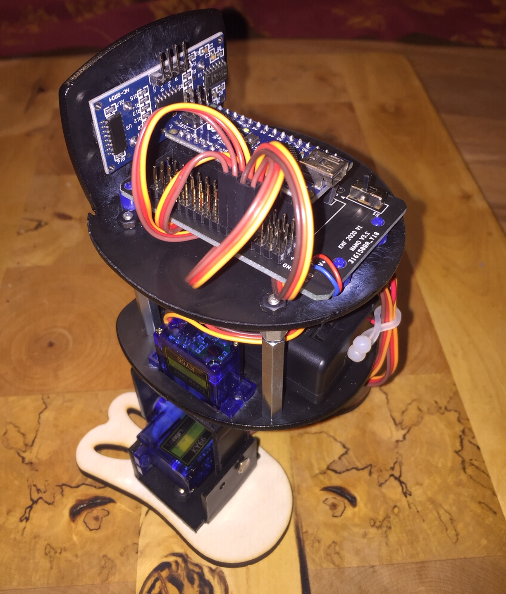

# Jo
Little Bot mit 4 Servos

## Bauanleitung

### Hardware

| Anzahl | Bezeichnung | 
| -------- | -------- | 
| 1  | ABS Platte DINA4 2mm   |
| 4  |  Platinenhalter (3D-Druck)  |
| 4  | Abstandshalter M3*25 Kunststoff   |
|  1 | Ardunio NANO   |
|  4 | SG90 Servo   |
|  1 |  HCSR04 Ultraschallsensor  |
|  1 | LM 2596S Spannungsregler 5V   |
|  1 |  9V Batterie mit Gehäuse  |
| ---  | ---   |

	
#### Schrauben

| Anzahl | Bezeichnung | 
| -------- | -------- | 
| 10  | M1.5x5 |
| 6  |  M1.4x8  |
| 12   | M2x8   |
| 12  |  M2x8  |
| 18  |  M3x5  |
| 8  |  M3x8 Senkkopf  |
| ---  | ---   |

#### Muttern

| Anzahl | Bezeichnung | 
| -------- | -------- | 
| 6  | M1.4  |
| 12  |  M2  |
| 8  |  M3 selbstsichernd  |
|  --- |  ---  |

### Schritt 1: 

- Die ABS-Platten lasern, Verwende die lbrn Vorlagen

### Schritt 2: 

- Die Schenkel der Fersen und der Füße biegen und auf angegebenen Durchmesser aufbohren.

- Füße: Beide Schenkel gleich lang, Innenmaß 37 mm

- Bohrungen: 

- Ferse biegen, beide Schenkel gleich lang:

- Bohrungen: Für die 1,5mm Bohrungen des Servos, den Servo als Bohrschablone verwenden.

### Schritt 3: Die Platinenhalter drucken

### Schritt 4: Die Schrittmotoren auf die Grundplatte und an die Fersen montieren und verschrauben (alternativ kleben). 
Ferse und Schenkel verschrauben. Die Teile müssen beweglich bleiben, so dass der Schrittmotor den Schenkel bewegen kann.

### Schritt 5: Den Ultraschallsensor an die Deckplatte montieren (alternativ kleben).

### Schritt 6: Den Arduino NANO auf die Deckplatte montieren.

### Schritt 7: Den Batteriehalter an die Grundplatte montieren (alternativ kleben).

### Schritt 8: Die Schrittmotoren, den Ultraschallsensor und den Batteriehalter nach Schaltplan verdrahten.

### Schritt 9: Das Programm in den Arduino NANO laden

### Schritt 10: Funktionstest

   
<ol class="breadcrumb" style="border-top: 2px solid black;border-bottom:2px solid black; height: 45px; width: 900px;"> 
<a href="#oben">nach oben</a>
</ol>

 

